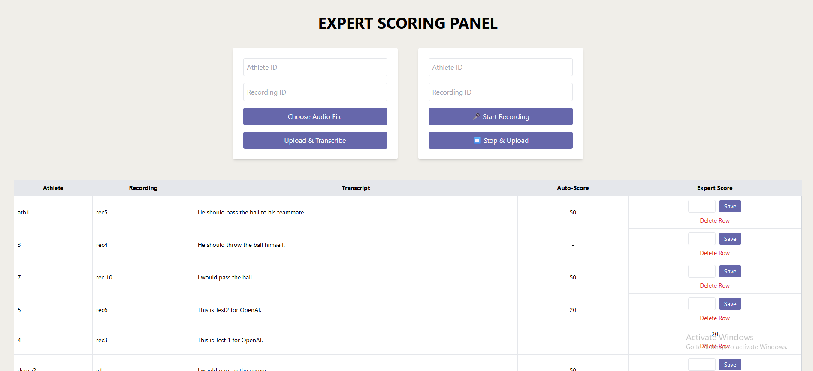

# Project 4: Options Generation Paradigm

This is a web-based application that allows athletes to submit audio responses either by uploading a file or recording via microphone. The system handles transcription, automatic scoring based on similarity, and expert evaluation, making it especially useful for sports coaching and research.
---

##  Features

- Upload audio files or record audio responses (e.g., `.webm`, `.wav`)
- Automatic transcription using OpenAI Whisper
- Cosine-similarity based auto-scoring
- Expert scoring interface
- MongoDB database for data storage
- React frontend with real-time response table

## Technologies Used

### Backend (Node.js + Express)
- **express** – API routing and server
- **mongoose** – MongoDB database connection and schema
- **cors** – Enable cross-origin requests
- **nodemon** – Auto-restarting server during development
- **dotenv** – Environment variable support
- **string-similarity** – Basic text similarity scoring (deprecated but used for simplicity)
- **child_process** – Native Node.js module to run Python scripts (Whisper)

#### Python Dependencies
- **Whisper** – OpenAI's automatic speech recognition
- **ffmpeg** – Audio conversion tool (must be installed separately)


### Frontend (React)
- **axios** – API requests
- **Tailwind CSS** – Styling framework


##  Tech Stack

- **Frontend:** React.js, Tailwind CSS
- **Backend:** Node.js, Express.js, Mongoose
- **Transcription:** Python, OpenAI Whisper, ffmpeg
- **Database:** MongoDB

## Interface

A view of the interface: 




##  Installation & Usage

### Backend Setup

```bash
cd backend
npm install
```
Create a `.env` file in `backend/` with:
```
MONGODB_URI=mongodb://localhost:27017/yourdbname
```
Run the backend:
```bash
npm run dev
```

### Frontend Setup

```bash
cd frontend
npm install
npm start
```
The app will be available at `http://localhost:3000`.

> Must have Python and ffmpeg installed system-wide.


##  API Endpoints

- `POST /api/upload` – Upload audio and trigger transcription + scoring
- `GET /api/responses` – Fetch all responses
- `PATCH /api/responses/:id` – Update expert score
- `DELETE /api/responses/:id` – Delete a response

---

##  Testing & Known Issues

###  Manual Testing Covered:
- Audio uploads and microphone recording
- Whisper transcription output verification
- Auto-score generation using text similarity
- Expert score submission and deletion

###  Known Issues:
- No auto-score for highly dissimilar responses (by design)
- Short/noisy recordings might fail transcription
- No authentication system in place


##  Folder Structure

```
project-root/
├── backend/
│   ├── controllers/
│   ├── models/
│   ├── routes/
│   └── whisper_transcribe.py
├── frontend/
│   ├── src/
│   └── public/
├── interface/
│   └── screenshot.png
└── README.md
```


## Author

Livia Kadisi 


## License

MIT License – feel free to adapt or improve.
